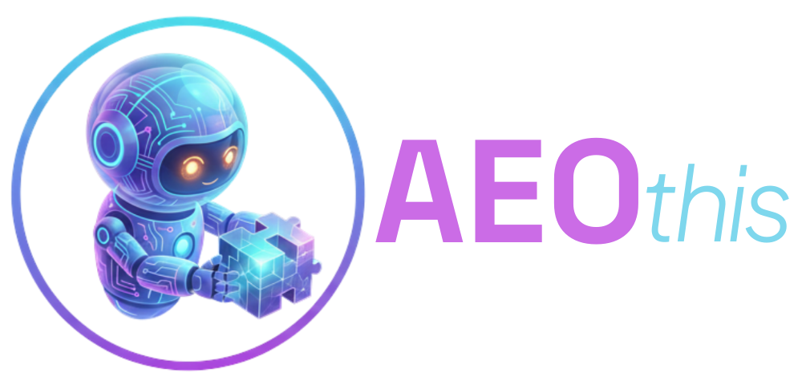

# Proposal Access Gate - Implementation Plan

> **Status: Completed** — Implemented 2026-03-09. This document is an archived planning record.

> **For Claude:** REQUIRED SUB-SKILL: Use superpowers:executing-plans to implement this plan task-by-task.

**Goal:** Encrypt client proposal pages with a 6-digit access code so only clients with the code can view their proposal.

**Architecture:** Python build script encrypts `<main>` content of proposal pages using AES-256-GCM (PBKDF2 key derivation from 6-digit code). Deployed page shows a lock screen with code input. Browser-side Web Crypto API decrypts on correct code entry. 7-day localStorage persistence.

**Tech Stack:** Python 3 (standard library: hashlib, os, base64, json), Web Crypto API (PBKDF2 + AES-GCM), vanilla JS, existing CSS variables.

---

### Task 1: Lock Screen CSS

**Files:**
- Modify: `~/aeothis-site/css/style.css` (append after line 1585)

**Step 1: Add lock screen styles to style.css**

Append these styles at the end of `style.css` (before the closing `}` of the mobile media query is already done, so append after line 1585):

```css
/* ── Access Gate ── */

.access-gate {
  position: fixed;
  inset: 0;
  z-index: 9999;
  background: #050505;
  display: flex;
  align-items: center;
  justify-content: center;
  flex-direction: column;
  padding: 24px;
}

.access-gate.is-unlocked {
  display: none;
}

.access-gate__logo {
  height: 32px;
  margin-bottom: 48px;
}

.access-gate__client {
  font-size: 22px;
  font-weight: 600;
  color: var(--text);
  margin-bottom: 8px;
  text-align: center;
}

.access-gate__heading {
  font-size: 16px;
  color: var(--text-light);
  margin-bottom: 32px;
  font-weight: 400;
}

.access-gate__inputs {
  display: flex;
  gap: 12px;
  margin-bottom: 24px;
}

.access-gate__digit {
  width: 52px;
  height: 64px;
  background: var(--bg-alt);
  border: 1px solid var(--border);
  border-radius: var(--radius);
  color: var(--text);
  font-size: 28px;
  font-weight: 700;
  text-align: center;
  font-family: inherit;
  outline: none;
  transition: border-color 0.2s;
  -moz-appearance: textfield;
}

.access-gate__digit::-webkit-outer-spin-button,
.access-gate__digit::-webkit-inner-spin-button {
  -webkit-appearance: none;
  margin: 0;
}

.access-gate__digit:focus {
  border-color: var(--accent);
}

.access-gate__digit--error {
  border-color: #e74c3c;
  animation: gate-shake 0.4s ease;
}

.access-gate__btn {
  background: var(--cta);
  color: #050505;
  border: none;
  padding: 14px 48px;
  border-radius: var(--radius);
  font-size: 16px;
  font-weight: 600;
  font-family: inherit;
  cursor: pointer;
  transition: opacity 0.2s;
}

.access-gate__btn:disabled {
  opacity: 0.3;
  cursor: not-allowed;
}

.access-gate__btn:not(:disabled):hover {
  opacity: 0.85;
}

.access-gate__error {
  color: #e74c3c;
  font-size: 14px;
  margin-top: 16px;
  min-height: 20px;
}

@keyframes gate-shake {
  0%, 100% { transform: translateX(0); }
  20% { transform: translateX(-8px); }
  40% { transform: translateX(8px); }
  60% { transform: translateX(-6px); }
  80% { transform: translateX(6px); }
}

/* Hide proposal content while locked */
body.is-locked > nav,
body.is-locked > main,
body.is-locked > footer {
  display: none;
}

@media (max-width: 768px) {
  .access-gate__inputs { gap: 8px; }
  .access-gate__digit { width: 44px; height: 56px; font-size: 24px; }
  .access-gate__client { font-size: 18px; }
}
```

**Step 2: Update cache bust version**

In any HTML files that reference `style.css`, the `?v=` param should be updated. The encrypt script will handle this automatically for proposal pages.

**Step 3: Commit**

```bash
cd ~/aeothis-site && git add css/style.css && git commit -m "feat: add access gate lock screen styles"
```

---

### Task 2: Unlock JavaScript

**Files:**
- Create: `~/aeothis-site/js/unlock.js`

**Step 1: Create the unlock script**

```javascript
(function () {
  'use strict';

  var gate = document.getElementById('access-gate');
  if (!gate) return;

  var slug = gate.dataset.slug;
  var salt = gate.dataset.salt;
  var iv = gate.dataset.iv;
  var ciphertext = gate.dataset.ciphertext;
  var storageKey = 'aeothis-access-' + slug;
  var TTL_DAYS = 7;

  // DOM refs
  var inputs = gate.querySelectorAll('.access-gate__digit');
  var btn = gate.querySelector('.access-gate__btn');
  var errorEl = gate.querySelector('.access-gate__error');

  // --- Crypto helpers ---

  function b64ToBytes(b64) {
    var bin = atob(b64);
    var bytes = new Uint8Array(bin.length);
    for (var i = 0; i < bin.length; i++) bytes[i] = bin.charCodeAt(i);
    return bytes;
  }

  function deriveKey(code, saltBytes) {
    var enc = new TextEncoder();
    return crypto.subtle.importKey('raw', enc.encode(code), 'PBKDF2', false, ['deriveKey'])
      .then(function (keyMaterial) {
        return crypto.subtle.deriveKey(
          { name: 'PBKDF2', salt: saltBytes, iterations: 100000, hash: 'SHA-256' },
          keyMaterial,
          { name: 'AES-GCM', length: 256 },
          false,
          ['decrypt']
        );
      });
  }

  function decrypt(code) {
    var saltBytes = b64ToBytes(salt);
    var ivBytes = b64ToBytes(iv);
    var ctBytes = b64ToBytes(ciphertext);

    return deriveKey(code, saltBytes)
      .then(function (key) {
        return crypto.subtle.decrypt({ name: 'AES-GCM', iv: ivBytes }, key, ctBytes);
      })
      .then(function (plainBuf) {
        return new TextDecoder().decode(plainBuf);
      });
  }

  // --- UI helpers ---

  function unlock(html) {
    var main = document.querySelector('main');
    if (main) {
      main.innerHTML = html;
    }

    document.body.classList.remove('is-locked');
    gate.classList.add('is-unlocked');

    // Show nav + main + footer
    var nav = document.querySelector('nav');
    var footer = document.querySelector('footer');
    if (nav) nav.style.display = '';
    if (main) main.style.display = '';
    if (footer) footer.style.display = '';

    // Re-init scroll animations
    initAnimations();
  }

  function initAnimations() {
    if (window.matchMedia('(prefers-reduced-motion: reduce)').matches) {
      document.querySelectorAll('.animate-on-scroll').forEach(function (el) {
        el.classList.add('is-visible');
      });
      return;
    }
    var observer = new IntersectionObserver(function (entries) {
      entries.forEach(function (entry) {
        if (entry.isIntersecting) {
          entry.target.classList.add('is-visible');
          observer.unobserve(entry.target);
        }
      });
    }, { threshold: 0.15, rootMargin: '0px 0px -50px 0px' });

    document.querySelectorAll('.animate-on-scroll').forEach(function (el) {
      observer.observe(el);
    });
  }

  function showError() {
    errorEl.textContent = 'Invalid code. Please try again.';
    inputs.forEach(function (inp) {
      inp.classList.add('access-gate__digit--error');
    });
    setTimeout(function () {
      inputs.forEach(function (inp) {
        inp.classList.remove('access-gate__digit--error');
        inp.value = '';
      });
      inputs[0].focus();
      btn.disabled = true;
    }, 500);
  }

  function getCode() {
    var code = '';
    inputs.forEach(function (inp) { code += inp.value; });
    return code;
  }

  function updateBtn() {
    btn.disabled = getCode().length !== 6;
  }

  // --- Input behavior ---

  inputs.forEach(function (inp, idx) {
    inp.addEventListener('input', function () {
      errorEl.textContent = '';
      if (inp.value.length > 1) inp.value = inp.value.slice(-1);
      if (inp.value && idx < inputs.length - 1) inputs[idx + 1].focus();
      updateBtn();
    });

    inp.addEventListener('keydown', function (e) {
      if (e.key === 'Backspace' && !inp.value && idx > 0) {
        inputs[idx - 1].focus();
      }
      if (e.key === 'Enter' && getCode().length === 6) {
        btn.click();
      }
    });

    // Select content on focus for easy overwrite
    inp.addEventListener('focus', function () {
      inp.select();
    });

    // Handle paste
    inp.addEventListener('paste', function (e) {
      e.preventDefault();
      var pasted = (e.clipboardData || window.clipboardData).getData('text').replace(/\D/g, '').slice(0, 6);
      for (var i = 0; i < pasted.length && i + idx < inputs.length; i++) {
        inputs[idx + i].value = pasted[i];
      }
      var focusIdx = Math.min(idx + pasted.length, inputs.length - 1);
      inputs[focusIdx].focus();
      updateBtn();
    });
  });

  // --- Unlock action ---

  btn.addEventListener('click', function () {
    var code = getCode();
    if (code.length !== 6) return;
    btn.disabled = true;
    btn.textContent = 'Unlocking...';

    decrypt(code)
      .then(function (html) {
        // Save to localStorage
        try {
          var expiry = Date.now() + TTL_DAYS * 24 * 60 * 60 * 1000;
          localStorage.setItem(storageKey, JSON.stringify({ code: code, expiry: expiry }));
        } catch (e) { /* localStorage unavailable, continue anyway */ }

        unlock(html);
      })
      .catch(function () {
        btn.textContent = 'Unlock';
        showError();
      });
  });

  // --- Auto-unlock from localStorage ---

  try {
    var stored = JSON.parse(localStorage.getItem(storageKey));
    if (stored && stored.code && stored.expiry > Date.now()) {
      decrypt(stored.code)
        .then(function (html) { unlock(html); })
        .catch(function () {
          localStorage.removeItem(storageKey);
        });
      return; // Skip showing lock screen interaction until decrypt resolves
    }
  } catch (e) { /* no stored access */ }

  // Focus first input
  inputs[0].focus();
})();
```

**Step 2: Commit**

```bash
cd ~/aeothis-site && git add js/unlock.js && git commit -m "feat: add client-side AES-GCM decryption for proposal access gate"
```

---

### Task 3: Python Encryption Script

**Files:**
- Create: `~/aeothis-tools/encrypt_proposal.py`

**Step 1: Create the encryption script**

```python
#!/usr/bin/env python3
"""Encrypt a client proposal page with a 6-digit access code.

Usage:
    python3 encrypt_proposal.py <slug>
    python3 encrypt_proposal.py <slug> --code 123456
"""

import argparse
import base64
import hashlib
import json
import os
import re
import sys

SITE_DIR = os.path.expanduser('~/aeothis-site')
ITERATIONS = 100000


def generate_code():
    """Generate a random 6-digit code."""
    return f'{int.from_bytes(os.urandom(4), "big") % 1000000:06d}'


def encrypt_aes_gcm(plaintext_bytes, code, salt):
    """Encrypt using AES-256-GCM with PBKDF2-derived key.

    Uses cryptography library for AES-GCM since stdlib doesn't support it.
    """
    from cryptography.hazmat.primitives.ciphers.aead import AESGCM
    from cryptography.hazmat.primitives.kdf.pbkdf2 import PBKDF2HMAC
    from cryptography.hazmat.primitives import hashes

    kdf = PBKDF2HMAC(
        algorithm=hashes.SHA256(),
        length=32,
        salt=salt,
        iterations=ITERATIONS,
    )
    key = kdf.derive(code.encode('utf-8'))

    iv = os.urandom(12)
    aesgcm = AESGCM(key)
    ciphertext = aesgcm.encrypt(iv, plaintext_bytes, None)

    return iv, ciphertext


def extract_main_content(html):
    """Extract everything between the first <main> and </main> tags.

    If no <main> tags exist, extract the body content between </nav> and <footer>,
    wrapping it in <main> tags.
    """
    # Try <main> tags first
    match = re.search(r'(<main[^>]*>)(.*?)(</main>)', html, re.DOTALL)
    if match:
        return match.group(2), match.start(2), match.end(2)

    # Fallback: content between </nav> and <footer>
    nav_end = html.find('</nav>')
    footer_start = html.find('<footer')
    if nav_end != -1 and footer_start != -1:
        content_start = nav_end + len('</nav>')
        content = html[content_start:footer_start]
        return content, content_start, footer_start

    print('Error: Could not find proposal content boundaries.', file=sys.stderr)
    sys.exit(1)


def build_locked_html(original_html, client_name, slug, salt_b64, iv_b64, ct_b64):
    """Build the locked version of the proposal page."""

    # Extract head content to preserve it
    head_match = re.search(r'<head>(.*?)</head>', original_html, re.DOTALL)
    head_content = head_match.group(1) if head_match else ''

    # Update cache bust version
    head_content = re.sub(r'style\.css\?v=\d+', 'style.css?v=20260309b', head_content)

    # Extract nav
    nav_match = re.search(r'(<nav.*?</nav>)', original_html, re.DOTALL)
    nav_html = nav_match.group(1) if nav_match else ''

    # Extract footer
    footer_match = re.search(r'(<footer.*?</footer>)', original_html, re.DOTALL)
    footer_html = footer_match.group(1) if footer_match else ''

    locked_page = f'''<!DOCTYPE html>
<html lang="en">
<head>
{head_content.strip()}
</head>
<body class="is-locked">

  <!-- ACCESS GATE -->
  <div id="access-gate" class="access-gate"
    data-slug="{slug}"
    data-salt="{salt_b64}"
    data-iv="{iv_b64}"
    data-ciphertext="{ct_b64}">
    
    <div class="access-gate__client">{client_name}</div>
    <div class="access-gate__heading">Enter your access code</div>
    <div class="access-gate__inputs">
      <input type="number" class="access-gate__digit" min="0" max="9" inputmode="numeric" pattern="[0-9]" aria-label="Digit 1">
      <input type="number" class="access-gate__digit" min="0" max="9" inputmode="numeric" pattern="[0-9]" aria-label="Digit 2">
      <input type="number" class="access-gate__digit" min="0" max="9" inputmode="numeric" pattern="[0-9]" aria-label="Digit 3">
      <input type="number" class="access-gate__digit" min="0" max="9" inputmode="numeric" pattern="[0-9]" aria-label="Digit 4">
      <input type="number" class="access-gate__digit" min="0" max="9" inputmode="numeric" pattern="[0-9]" aria-label="Digit 5">
      <input type="number" class="access-gate__digit" min="0" max="9" inputmode="numeric" pattern="[0-9]" aria-label="Digit 6">
    </div>
    <button class="access-gate__btn" disabled>Unlock</button>
    <div class="access-gate__error"></div>
  </div>

  {nav_html}

  <main></main>

  {footer_html}

  <script src="../../js/unlock.js"></script>

</body>
</html>'''

    return locked_page


def main():
    parser = argparse.ArgumentParser(description='Encrypt a client proposal page.')
    parser.add_argument('slug', help='Client slug (e.g., fit-kids-care)')
    parser.add_argument('--code', help='Use a specific 6-digit code instead of generating one')
    args = parser.parse_args()

    slug = args.slug
    proposal_dir = os.path.join(SITE_DIR, 'clients', slug)
    index_path = os.path.join(proposal_dir, 'index.html')
    unencrypted_path = os.path.join(proposal_dir, 'index.unencrypted.html')
    code_path = os.path.join(proposal_dir, '.access-code')

    # Read the source file (prefer unencrypted backup if it exists)
    source_path = unencrypted_path if os.path.exists(unencrypted_path) else index_path
    if not os.path.exists(source_path):
        print(f'Error: {source_path} not found.', file=sys.stderr)
        sys.exit(1)

    with open(source_path, 'r', encoding='utf-8') as f:
        original_html = f.read()

    # Determine the code
    if args.code:
        code = args.code
    elif os.path.exists(code_path):
        with open(code_path, 'r') as f:
            code = f.read().strip()
        print(f'Reusing existing code from .access-code')
    else:
        code = generate_code()

    if not re.match(r'^\d{6}$', code):
        print(f'Error: Code must be exactly 6 digits. Got: {code}', file=sys.stderr)
        sys.exit(1)

    # Extract client name from the page title or h1
    name_match = re.search(r'<h1[^>]*class="proposal-hero__client[^"]*"[^>]*>(.*?)</h1>', original_html)
    if not name_match:
        name_match = re.search(r'<title>(.*?)[-|]', original_html)
    client_name = name_match.group(1).strip() if name_match else slug.replace('-', ' ').title()

    # Extract the content to encrypt
    content, start_idx, end_idx = extract_main_content(original_html)

    # The content to encrypt includes nav, all sections, footer script
    # We encrypt everything between </nav> and <footer> (the proposal body)
    # Plus the inline scroll animation script
    script_match = re.search(r'(<script>.*?</script>)\s*</body>', original_html, re.DOTALL)
    script_html = script_match.group(1) if script_match else ''

    # Content to encrypt: all sections between nav and footer
    encrypt_content = content.strip()

    # Encrypt
    salt = os.urandom(16)
    plaintext_bytes = encrypt_content.encode('utf-8')
    iv, ciphertext = encrypt_aes_gcm(plaintext_bytes, code, salt)

    salt_b64 = base64.b64encode(salt).decode('ascii')
    iv_b64 = base64.b64encode(iv).decode('ascii')
    ct_b64 = base64.b64encode(ciphertext).decode('ascii')

    # Save unencrypted backup
    with open(unencrypted_path, 'w', encoding='utf-8') as f:
        f.write(original_html)

    # Save access code
    with open(code_path, 'w') as f:
        f.write(code)

    # Build and write locked page
    locked_html = build_locked_html(original_html, client_name, slug, salt_b64, iv_b64, ct_b64)
    with open(index_path, 'w', encoding='utf-8') as f:
        f.write(locked_html)

    print(f'Encrypted: {index_path}')
    print(f'Backup:    {unencrypted_path}')
    print(f'')
    print(f'  Access code for {client_name}: {code}')
    print(f'')
    print(f'  URL: https://aeothis.com/clients/{slug}/')


if __name__ == '__main__':
    main()
```

**Step 2: Make executable**

```bash
chmod +x ~/aeothis-tools/encrypt_proposal.py
```

**Step 3: Ensure cryptography library is installed**

```bash
pip3 install cryptography
```

**Step 4: Commit**

```bash
cd ~/aeothis-tools && git add encrypt_proposal.py && git commit -m "feat: add proposal encryption script with AES-256-GCM"
```

---

### Task 4: Update .gitignore

**Files:**
- Modify: `~/aeothis-site/.gitignore` (create if doesn't exist)

**Step 1: Add entries for unencrypted backups and access codes**

Add these lines:

```
# Proposal encryption
*.unencrypted.html
.access-code
```

**Step 2: Commit**

```bash
cd ~/aeothis-site && git add .gitignore && git commit -m "chore: gitignore unencrypted proposal backups and access codes"
```

---

### Task 5: Test with Fit Kids Care

**Step 1: Run the encryption script**

```bash
python3 ~/aeothis-tools/encrypt_proposal.py fit-kids-care
```

Expected output:
```
Encrypted: /home/ubuntu/aeothis-site/clients/fit-kids-care/index.html
Backup:    /home/ubuntu/aeothis-site/clients/fit-kids-care/index.unencrypted.html

  Access code for Fit Kids Care: XXXXXX

  URL: https://aeothis.com/clients/fit-kids-care/
```

**Step 2: Verify the encrypted page locally**

Open `~/aeothis-site/clients/fit-kids-care/index.html` and confirm:
- No proposal content is visible in the HTML source (only base64 ciphertext in data attributes)
- The lock screen HTML structure is present
- The `<main>` tag is empty

**Step 3: Test in browser**

Use Playwright to:
1. Open the local file or serve it
2. Verify the lock screen renders
3. Enter the correct code
4. Verify the proposal content appears
5. Enter a wrong code
6. Verify the error state shows

**Step 4: Deploy and verify live**

```bash
cd ~/aeothis-site && git add clients/fit-kids-care/index.html && git commit -m "feat: encrypt fit-kids-care proposal with access gate" && git push
```

Wait 60 seconds, then visit `https://aeothis.com/clients/fit-kids-care/` and test the full flow.

**Step 5: Test re-encryption with same code**

```bash
python3 ~/aeothis-tools/encrypt_proposal.py fit-kids-care
```

Verify it outputs "Reusing existing code" and the same code as before.
